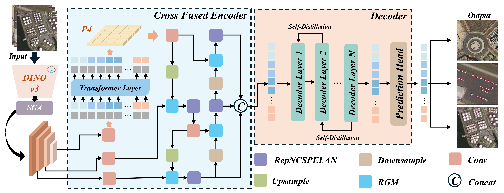

<h1 align="center">
  🛰️ SKYDET: An End-to-End Multi-Scale Attentive Detection Network<br>
  from Foundation Models for Small Objects<br>
  in Remote Sensing Images
</h1>

<p align="center">
  <strong><em>
    Yao Zhang, Wei Guo, Boxiang Xie, Lingfeng Lin, Jie Zhang,<br>
    Hongwei Yang, Yuke Meng, Yi Liu, Wei Zhang
  </em></strong>
</p>

<p align="center">
  <a href="https://ieeexplore.ieee.org/document/11623293"></a>
  <a href="./LICENSE"></a>
</p>

<p align="justify">
  SKYDET is an end-to-end remote sensing object detector for dense small-object detection in complex aerial scenes.
  It is built on DETR-style detection and explores how DINOv3 foundation representations can be transferred to remote sensing imagery through dedicated multi-scale adaptation and cross-scale fusion modules.
</p>

<p align="center">
  <a href="figure/framework.png"></a>
</p>

---

<a id="news"></a>

## 📰 News

- **[2026.09]** We have updated the README with clearer formatting and an architecture overview to make SKYDET easier to understand and use.
- **[2026.07]** Our paper has been accepted by TGRS!
- **[2026.01]** Initial release of SKYDET code.

---

<a id="installation"></a>

##  1. Installation

### Environment

- Python >= 3.10
- PyTorch >= 2.0
- CUDA >= 11.8
- torchvision
- pycocotools

### Install dependencies

```bash
conda create -n skydet python=3.10 -y
conda activate skydet
pip install -r requirements.txt
```
---

<a id="repository-structure"></a>

## 🗂️ 2. Repository Structure

```text
SKYDET/
├── configs/
│   ├── base/
│   ├── dataset/
│   ├── dinov3_convnext_with_dfine/
│   ├── dinov3_vits_with_dfine/
│   ├── runtime.yml
│   └── skydet/
│       ├── skydet_3scale.yml
│       └── skydet_4scale.yml
├── engine/
│   ├── backbone/
│   ├── core/
│   ├── data/
│   ├── misc/
│   ├── optim/
│   ├── skydet/
│   └── solver/
├── tools/
│   ├── benchmark/
│   ├── dataset/
│   ├── deployment/
│   ├── inference/
│   ├── reference/
│   └── visualization/
├── requirements.txt
└── train.py
```

<a id="data-preparation"></a>

##  3. Data Preparation

This repository provides dataset configs for:

- DOTA-v1.0
- NWPU VHR-10
- AI-TOD
- Custom dataset

The default custom config uses the following structure:

```text
dataset/
├── train/
│   ├── images/ or image files directly under train/
│   └── train.json
└── val/
    ├── images/ or image files directly under val/
    └── val.json
```
---

<a id="pretrained-weights"></a>

##  4. Pretrained Weights

SKYDET relies on DINOv3-based pretrained backbones.

### Examples used in configs

For ConvNeXt-based SKYDET:

```yaml
ConvNeXt:
  pretrained: dinov3_convnext_tiny_pretrain_lvd1689m-21b726bb.pth
```

For ViT-based experiments, the config files in `configs/dinov3_vits_with_dfine/` use DINOv3 ViT weights such as:

```text
dinov3_vits16_pretrain_lvd1689m-08c60483.pth
```

Please download the required pretrained weights and modify the corresponding path in the config file.

---

<a id="training"></a>

## 🚀 5. Training

### Single-GPU training

```bash
python train.py -c configs/skydet/skydet_3scale.yml --use-amp --seed 0
```

### Multi-GPU training

```bash
CUDA_VISIBLE_DEVICES=0,1,2,3 torchrun --master_port=7777 --nproc_per_node=4 \
train.py -c configs/skydet/skydet_3scale.yml --use-amp --seed 0
```


<a id="evaluation"></a>

##  6. Evaluation


```bash
python train.py -c configs/skydet/skydet_3scale.yml --test-only -r path/to/checkpoint.pth
```

<a id="inference"></a>

##  7. Inference

Visualized PyTorch inference

```bash
python tools/inference/torch_inf_vis.py \
-c configs/skydet/skydet_3scale.yml \
-r path/to/checkpoint.pth \
-i path/to/image
```

---

<a id="citation"></a>

## 📖 8. Citation

```
@article{zhang2026skydet,
  title={SKYDET: An End-to-End Multi-Scale Attentive Detection Network from Foundation Models for Small Objects in Remote Sensing Images},
  author={Zhang, Yao and Guo, Wei and Xie, Boxiang and Lin, Lingfeng and Zhang, Jie and Yang, Hongwei and Meng, Yuke and Liu, Yi and Zhang, Wei},
  journal={IEEE Transactions on Geoscience and Remote Sensing},
  year={2026},
  publisher={IEEE}
}
```

<a id="acknowledgement"></a>

##  9. Acknowledgement

This repository is built upon several excellent open-source projects in the DETR family. We sincerely thank the authors of:

- [RT-DETR](https://github.com/lyuwenyu/RT-DETR)
- [D-FINE](https://github.com/Peterande/D-FINE)
- [DEIM](https://github.com/ShihuaHuang95/DEIM)

for their inspiring work and open-source contributions.

---
